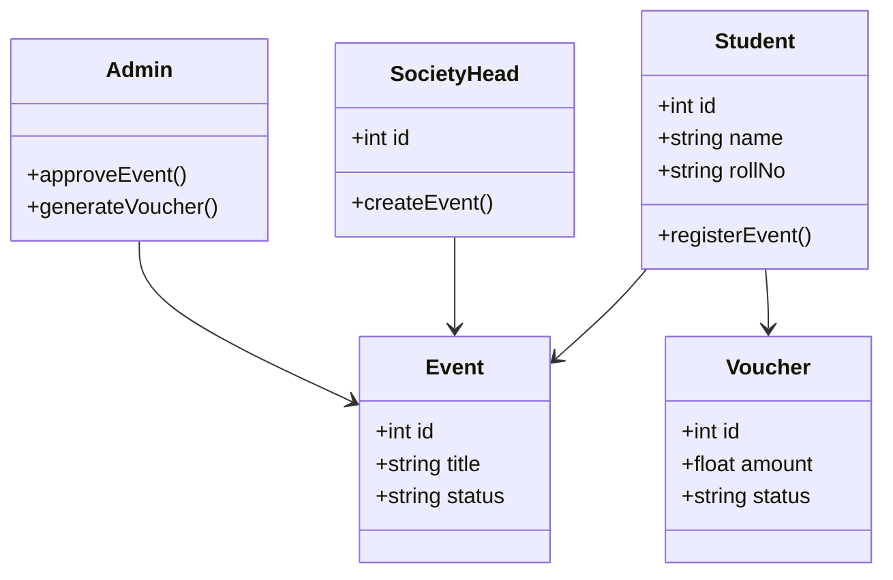
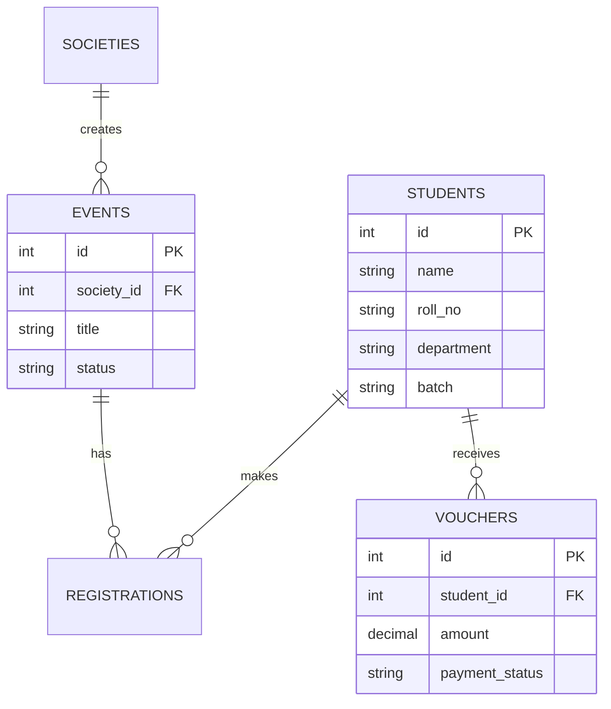

# Sample Input and Sample Output

## Sample Input

```text
Build a campus event and society management system where students can register, societies can create events, admin can approve events, generate fee vouchers, track payments, manage departments/batches, and export attendance/reports. The system should have role based dashboards for admin, society head, and student.
```

## Sample Output — Requirement Analysis

The system is a campus-focused event and society management platform. It supports students, society heads, and admins. The system manages event creation, approval, registration, voucher generation, payment tracking, attendance, and reports.

The main modules are authentication, student management, society management, event management, voucher/payment management, attendance management, and reporting.

## Sample Output — Functional Requirements

1. Students can register and log in.
2. Students can view available events.
3. Students can register for events.
4. Society heads can create event requests.
5. Admin can approve or reject event requests.
6. System can generate student fee vouchers.
7. Admin can track voucher payment status.
8. Admin can manage departments, batches, and societies.
9. System can export attendance and event reports.
10. System provides role-based dashboards.

## Sample Output — Non-Functional Requirements

1. UI should be responsive.
2. API keys should be stored in environment variables.
3. System should validate all required fields.
4. System should handle API failure gracefully.
5. System should store generated projects for history.
6. Code should be modular and maintainable.

## Sample Output — UML Mermaid



## Sample Output — ERD Mermaid



## Sample Output — Database Schema

```sql
CREATE TABLE students (
  id INTEGER PRIMARY KEY AUTOINCREMENT,
  name TEXT NOT NULL,
  roll_no TEXT UNIQUE NOT NULL,
  department TEXT NOT NULL,
  batch TEXT NOT NULL,
  created_at TEXT DEFAULT CURRENT_TIMESTAMP
);

CREATE TABLE societies (
  id INTEGER PRIMARY KEY AUTOINCREMENT,
  name TEXT NOT NULL,
  description TEXT
);

CREATE TABLE events (
  id INTEGER PRIMARY KEY AUTOINCREMENT,
  society_id INTEGER NOT NULL,
  title TEXT NOT NULL,
  description TEXT,
  status TEXT DEFAULT 'pending',
  created_at TEXT DEFAULT CURRENT_TIMESTAMP,
  FOREIGN KEY (society_id) REFERENCES societies(id)
);

CREATE TABLE vouchers (
  id INTEGER PRIMARY KEY AUTOINCREMENT,
  student_id INTEGER NOT NULL,
  amount REAL NOT NULL,
  payment_status TEXT DEFAULT 'unpaid',
  created_at TEXT DEFAULT CURRENT_TIMESTAMP,
  FOREIGN KEY (student_id) REFERENCES students(id)
);
```

## Sample Output — Starter Code Skeleton

```python
from fastapi import FastAPI, HTTPException
from pydantic import BaseModel

app = FastAPI(title="Campus Event Management API")

class EventCreate(BaseModel):
    title: str
    description: str
    society_id: int

EVENTS = []

@app.post("/events")
def create_event(payload: EventCreate):
    event = {"id": len(EVENTS) + 1, **payload.model_dump(), "status": "pending"}
    EVENTS.append(event)
    return event

@app.get("/events")
def list_events():
    return EVENTS
```

## Sample Output — Suggested Technology Stack

- Frontend: React.js + Tailwind CSS
- Backend: FastAPI
- Database: SQLite for prototype, PostgreSQL for production
- Diagrams: Mermaid.js
- AI: Gemini/Groq/OpenAI API
- Deployment: Vercel frontend + Render/Railway backend
